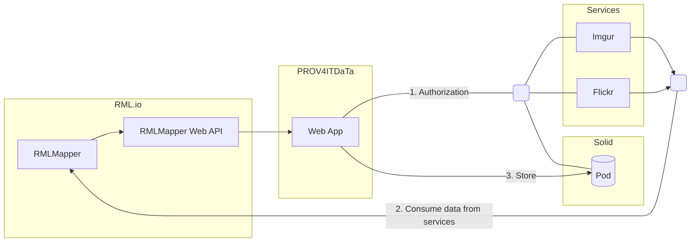
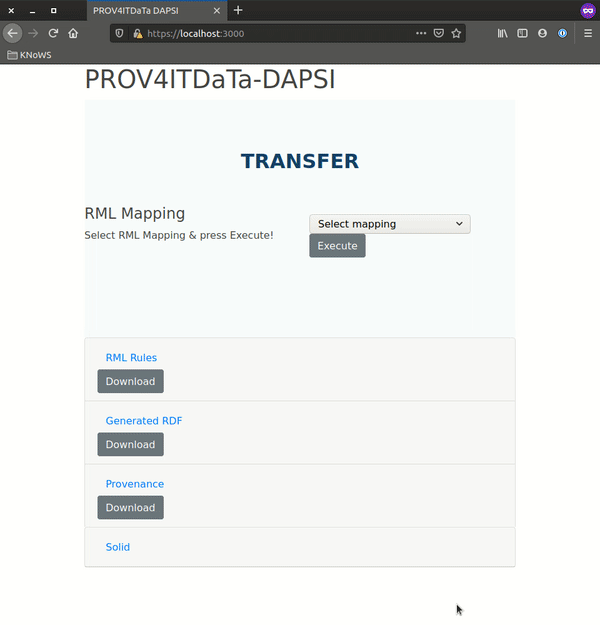

# PROV4ITDaTa - Technical Report

Data portability is one of the pillars to enable users to control their data on the Web.
Initiatives such as the [Data Transfer Project][DTP] (DTP) take a step in this direction,
by providing an open-source, service-to-service data portability platform
so that individuals could move their data whenever they want.
However, such efforts — being hard-coded — miss transparency and interoperability.
On the one hand, when data is transferred between services,
there is no trust in whether this transfer was of high quality.
Assessment would require reviewing the source code, as data provenance is unavailable.
On the other hand, complying to this hard-coded platform requires development effort to create custom data models.
Existing interoperability standards are neglected.

In PROV4ITDaTa, we create a solution that is fully transparent and has fine-grained configuration to improve interoperability with other data models. Furthermore, the intermediate dataset generated from the source data and its provenance are [FAIR] resources.
To achieve this, we will exploit and advance the existing open-source tools [RML.io] and [Comunica]
and show its extensibility by directly applying it to the [Solid] ecosystem.

- RML.io is a declarative and generic toolset
to transparently generate FAIR Linked Data from (semi-)structured heterogeneous data
with automatic data provenance and fine-grained configuration to extract and transform (parts of) the source data.
- Using Comunica, we can query multiple intermediate datasets to transfer to a new
service, generating a provenance trail of where the resulting data came from.

Combining RML.io and Comunica for a fully transparent transfer process,
we improve current data portability approaches.
Also, assessing the provenance trail can add trust to a transfer process.
Being a fine-grained and declarative system, it sets up detailed configuration and provenance generation.
The transfer of personal data can be assessed before the data is accessed,
and legal audits can be performed automatically based on the structured and semantically sound provenance trail.
To show its applicability and extensibility for decentralized environments,
we will connect it to the Solid ecosystem,
giving users full control over their data.

> This is an intermediate report. As such, some sections are currently intentionally left blank or incomplete.

## Alignment to the DAPSI milestones

### M1: Design configuration-based DTP exporter, applying it to a use case (deadline 10/2020)

See [Architecture](#architecture) on how we used RML.io to export data from DTP-like services

### M2: Improve data provenance of the DTP exporter (deadline 12/2020)

> This work is ongoing

See [Components/RMLMapper](#rmlmapper) and [Components/Web App](#web-app)
on how we automatically generate and showcase data provenance information as an interoperable resource in RDF.

### M3: Design query-based DTP importer for Solid, applying it to a use case (deadline 01/2020)

> This work is ongoing

Currently, we directly import the exported data in RDF into a Solid pod, see [Components/Web App](#web-app).

### M4: Implement configuration-based DTP exporter (deadline 04/2020)

> This work is ongoing

See [Components/RML Mapping Documents](#rml-mapping-documents) and [Components/RMLMapper](#rmlmapper)
on how we allow personalizable and configurable export of multiple DTP services in RDF, using RML.io.

### M5: Implement provenance-based DTP exporter (deadline 05/2020)

> This work is ongoing

We are currently prototyping this feature, based on the design we made in <https://github.com/comunica/comunica/issues/732/>.

### M6: Implement query-based DTP importer for Solid (deadline 04/2020)

> This work is ongoing

Currently, we directly import the exported data in RDF into a Solid pod, see [Components/Web App](#web-app).
To allow for configurability, we already support multiple configurations
for exporting the data, see our progress in M4.

### M7: Integrate and finalize the exporter and importer, showcasing the use case (deadline 05/2020)

> This work is ongoing

Our first sprint is finished with an end-to-end solution without query-based importer, see [Demonstrator](#demonstrator).

- [ ] TODO check the _minimum_ we should adhere to

## Architecture

- [x] TODO @gdm insert architecture figure and describe the components in the section below

### Components

- [ ] TODO @gdm short introduction of the different components, with relevant links

The architecture comprises four main components

- PROVIT4DaTa Web App
- Services
- RML.io toolset
- Solid

The main component is the PROV4ITDaTa Web App, which performs the different steps required for transferring data from services (e.g. Flickr, Imgur, etc.) to a Solid pod. During the first step, the Web App obtains the credentials for authorized access to the services and the Solid pod. In the second step, the RML.io toolset provides the necessary components for 1) consuming (protected) resources from Web APIs, and 2) transformation to [RDF]. In the third step, the [Web App] finalizes the data transfer by storing the [RDF], generated by the [RMLMapper], to the Solid Pod.

#### [RML Mapping documents][RML-spec]

An RML Mapping provides the means to create semantically enriched RDF data from heterogenous and (semi-) structured sources, using a declarative set of rules ([RML-spec]).

#### [RMLMapper][RMLMapper-JAVA]

- [ ] TODO @gdm Make sure to mention the PROV generation and link to [section](#automatic-data-provenance-generation)

The [RMLMapper], proxied by the [RMLMapper Web API], processes the  selected [RML Mapping] and yields both the generated [RDF] and [provenance](#automatic-data-provenance-generation) data.

#### Web App

- [x] TODO @gdm Make sure to mention the PROV download
- [x] TODO @gdm Make sure to mention the Solid storage
- [ ] TODO @gdm Make sure to mention the HTTPS connection everywhere

The Web App is the main entrypoint. Allowing the user to select and execute an [RML Mapping] describing which service to consume and how that data will be transformed to [RDF]. 

Upon selecting an [RML Mapping], the user can view and download its contents through the corresponding "RML Rules"-card (see [Demonstrator](#Demonstrator)).
The Web App guides the user through the necessary authorization steps, prior to execution. 

After successful execution, the generated [RDF] and [provenance](#automatic-data-provenance-generation) become available for inspection and download. 

By providing the user not only with the generated [RDF] but also with the [data-provenance](#automatic-data-provenance-generation), we address the transparency requirement other solutions lack.

Furthermore, the resulting [RDF] will also be stored onto the user's [Solid] pod. Which can also be verified through the "Solid"-card (see [Demonstrator](#Demonstrator)).

### Relation to DTP

After reviewing the DTP repository, we concluded that although utilitary functions could be reused in a later stage,
we currently focus on an end-to-end system using solely RML.io and Comunica.
On the one hand, because these technologies allow more advanced data transfer processes than DTP (such as joining data from _different services_ on the fly),
on the other hand, because integration efforts would put a too high burden on the current development sprints.

Once we have successfully created and validated our end-to-end demonstrator,
we will re-evaluate DTP and how we can properly integrate our technologies.

## Requirements

- [ ] clarify it can do that same as DTP

We set out following requirements,
and linked them to the specific sections of the features we currently support,

- Configurable data portability and Personalization (available using personalized RML Mapping documents to configure the data transfer, see [section](#mapping-files-to-transfer-data))
- White-box data portability (via automatic data provenance generation, see [section](#automatic-data-provenance-generation))
- Data Transparency when transferring your data (available as RML Mapping documents are also RDF, see [section](#mapping-files-to-transfer-data))
- FAIR Data Transfer (by using RDF as intermediate data model, see [section](#output-rdf))
- Data Interoperability (by using RDF as intermediate data model and configuration data model, see [section](#output-rdf) and [section](#mapping-files-to-transfer-data))
- [ ] TODO write list of requirements, and link to the different sections that fixes those requirements
- Security (using standard secure connections such as HTTPS, see [section](#security))
- Quality (using default configuration files crafted by experts, and bound to quality checks, see [section](#quality))

In general, our system is comparable to DTP, as it supports (and is extensible to) multiple data sources, and allows data import into SOLID (see [section](#data-portability)).

## Demonstrator

- [ ] TODO describe the current demonstrator
- [ ] TODO @gdm Please create a gif of a working demonstrator

The upper part of the landing page provides the means for quickly initiating the transfer from a service to a [Solid] pod. Once the user selects the desired [RML Mapping], the transfer can be initiated by clicking the Execute-button. Initially, the user will be prompted to authorize with the [Solid] pod and service defined as source in the [RML Mapping].

The lower part allows the user to review

- The [RML Mapping]
- The generated [RDF]
- The [provenance](#automatic-data-provenance-generation). Hence, upholding the transparency of our solution. 

Furthermore, the user can inspect and verify that the generated [RDF] was successfully stored on to the [Solid] pod.

## Use cases

- [ ] TODO clarify this is all extensible
- [ ] TODO list all data fields that are being mapped for each source

### Flickr

### Imgur

## Features

- [ ] TODO list of features

### Mapping files to transfer data

_All transformation configuration is published as RML Mapping documents, which are [RDF] using established vocabularies_

This enables FAIR data Transfer because TODO.

This enables data Interoperability because TODO.

These mapping files are manually created according to best practices TODO.

### Automatic Data Provenance Generation

- [ ] TODO @bdm list relevant papers and relevant other stuff

This supports data transparency because TODO.

### Output RDF

- [ ] Check Syntactic Interoperability (connectivity, endpoint invocation), Check Semantic Interoperability, Check Structural interoperability, Data Compatibility, specific standard

### Security

HTTPS
Access control: you need the developer key of the individual services

### Personalization

- [ ] TODO it's configurable: show configurability

### Quality

- [ ] TODO prove quality

### Data portability

- [ ] prove it works for multiple data sources
- [ ] prove it works for SOLID

## Legal

- [ ] TODO @bdm complete this section

- [ ] TODO clarify that users take control of their own data: they become data controllers.

- [ ] TODO GDPR ok because 1/2/3

[Comunica]: https://comunica.dev/
[DTP]: https://datatransferproject.dev/
[FAIR]: https://www.go-fair.org/
[RDF]: https://www.w3.org/TR/rdf-concepts/
[RML.io]: https://rml.io
[RML-spec]: http://rml.io/spec.html
[RMLMapper-JAVA]: https://github.com/RMLio/rmlmapper-java
[Solid]: https://inrupt.com/solid/
