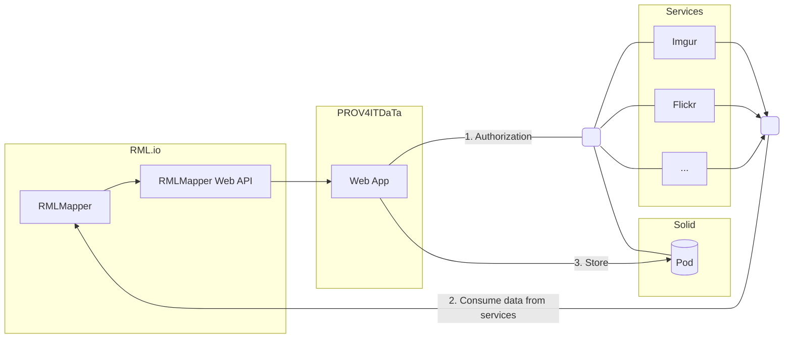

# PROV4ITDaTa - Technical Report

> An online version of this report is available at <https://prov4itdata.ilabt.imec.be/docs/>

Data portability is one of the pillars to enable users to control their data on the Web.
Initiatives such as the [Data Transfer Project][DTP] (DTP) take a step in this direction,
by providing an open-source, service-to-service data portability platform
so that individuals could move their data whenever they want.
However, such efforts — being hard-coded — miss transparency and interoperability.
On the one hand, when data is transferred between services,
there is no trust in whether this transfer was of high quality.
Assessment would require reviewing the source code, as data provenance is unavailable.
On the other hand, complying to this hard-coded platform requires development effort to create custom data models.
Existing interoperability standards are neglected.

In PROV4ITDaTa, we create a solution that is fully transparent and has fine-grained configuration to improve interoperability with other data models. Furthermore, the intermediate dataset generated from the source data and its provenance are [FAIR] resources.
To achieve this, we will exploit and advance the existing open-source tools [RML.io] and [Comunica]
and show its extensibility by directly applying it to the [Solid] ecosystem.

- RML.io is a declarative and generic toolset
to transparently generate FAIR Linked Data from (semi-)structured heterogeneous data
with automatic data provenance and fine-grained configuration to extract and transform (parts of) the source data.
- Using Comunica, we can query multiple intermediate datasets to transfer to a new
service, generating a provenance trail of where the resulting data came from.

Combining RML.io and Comunica for a fully transparent transfer process,
we improve current data portability approaches.
Also, assessing the provenance trail can add trust to a transfer process.
Being a fine-grained and declarative system, it sets up detailed configuration and provenance generation.
The transfer of personal data can be assessed before the data is accessed,
and legal audits can be performed automatically based on the structured and semantically sound provenance trail.
To show its applicability and extensibility for decentralized environments,
we will connect it to the Solid ecosystem,
giving users full control over their data.

> This is an intermediate report. As such, some sections are currently intentionally left blank or incomplete.

## Alignment to the DAPSI milestones

### M1: Design configuration-based DTP exporter, applying it to a use case (deadline 10/2020)

See [Architecture](#architecture) on how we used RML.io to export data from DTP-like services

### M2: Improve data provenance of the DTP exporter (deadline 12/2020)

> This work is ongoing

See [Components/RMLMapper](#rmlmapper) and [Components/Web App](#web-app)
on how we automatically generate and showcase data provenance information as an interoperable resource in RDF.

### M3: Design query-based DTP importer for Solid, applying it to a use case (deadline 01/2020)

> This work is ongoing

Currently, we directly import the exported data in RDF into a Solid pod, see [Components/Web App](#web-app).

### M4: Implement configuration-based DTP exporter (deadline 04/2020)

> This work is ongoing

See [Components/RML Mapping Documents](#rml-mapping-documents) and [Components/RMLMapper](#rmlmapper)
on how we allow personalizable and configurable export of multiple DTP services in RDF, using RML.io.

### M5: Implement provenance-based DTP exporter (deadline 05/2020)

> This work is ongoing

We are currently prototyping this feature, based on the design we made in <https://github.com/comunica/comunica/issues/732/>.

### M6: Implement query-based DTP importer for Solid (deadline 04/2020)

> This work is ongoing

Currently, we directly import the exported data in RDF into a Solid pod, see [Components/Web App](#web-app).
To allow for configurability, we already support multiple configurations
for exporting the data, see our progress in M4.

### M7: Integrate and finalize the exporter and importer, showcasing the use case (deadline 05/2020)

> This work is ongoing

Our first sprint is finished with an end-to-end solution without query-based importer, see [Demonstrator](#demonstrator).

- [ ] TODO check the _minimum_ we should adhere to

## Architecture



### Components

The architecture comprises four main components

- PROVIT4DaTa Web App: a user interface to allow users transparently transport their data
- Web Services: an extensible set of existing (social) web services from which the user can transfer its data
- RML.io toolset: a set of open-source tools to generate standardized knowledge graphs from heterogeneous data sources
- Solid pods: a personal data storage, putting the user in control of their own data

The main component is the PROV4ITDaTa Web App, which performs the different steps required for transferring data from services (e.g. Flickr, Imgur, etc.) to a Solid pod.

1. During the first step, the Web App obtains the credentials for authorized access to the services and the Solid pod.
2. In the second step, the RML.io toolset provides the necessary components for
   1. consuming (protected) resources from Web APIs, and
   2. transforming the fetched data to [RDF].
3. In the third step, the [Web App](#web-app) finalizes the data transfer by storing the [RDF], generated by the [RMLMapper-JAVA], to the Solid Pod.

#### [RML Mapping documents][RML-spec]

An RML Mapping provides the means to create semantically enriched RDF data from heterogenous and (semi-) structured sources, using a declarative set of rules ([RML][RML-spec]).

Describing the Web API as a source in an RML Mapping allows the [RMLMapper] to determine how requests should be made in order to consume the Web API. Furthermore, it requires a one-time effort and avoids hard-coded implementations for each service to be added. The mapping can easily be reused for -- and extended to -- similar Web APIs.

#### [RMLMapper][RMLMapper-JAVA]

- [ ] TODO @gdm Make sure to mention the PROV generation and link to [section](#automatic-data-provenance-generation)

The [RMLMapper], proxied by the [RMLMapper Web API](#web-app), processes the  selected RML Mapping and yields both the generated [RDF] and [provenance](#automatic-data-provenance-generation) data.

In the background, the RML Mapper determines how to consume a Web API based on its description, without the need for integrating code that is tightly coupled to a specific Web API. Such hard-coded implementations are error-prone and time-consuming (consider,  for example, the creation of tests and rebuilding the application every time a service is added).

#### Web App

The Web App is the main entrypoint, allowing the user to select and execute an [RML Mapping] describing which service to consume and how that data will be transformed to [RDF].

Upon selecting an RML Mapping, the user can view and download its contents through the corresponding "RML Rules"-card (see [Demonstrator](#Demonstrator)).
Using this RML Mapping, the user can inspect *how* its data will be processed **prior to execution**, and **without requiring to inspect the source code**.

> At this point, the raw RDF RML description is shown to the user,
> however, since it is a structured semantic format,
> automatic visualizations and explanatory descriptions can be created.

The Web App guides the user through the necessary authorization steps, prior to execution.
Given the vulnerable information being exchanged, communication with the Web App occurs over [HTTPS].

After successful execution, the generated [RDF] and [provenance](#automatic-data-provenance-generation) become available for inspection and download.
The provenance information, structured using the W3C recommended standard [PROV-O],
allows further automatic processing to validate that all data is processing correctly acccording to the users expectations.

By providing the user not only with the generated [RDF] but also with the [data-provenance](#automatic-data-provenance-generation),
we address the transparency requirement other solutions lack.

The resulting [RDF] is stored onto the user's [Solid] pod, which can be verified through the "Solid"-card (see [Demonstrator](#Demonstrator)).

As a result, this web app allows to unambiguously define the user's data using an RML Mapping and transparently transfer it between services.
The automatically generated provenance allows for inspection and validation of the processing.

### Relation to DTP

After reviewing the DTP repository, we concluded that although utilitary functions could be reused in a later stage,
we currently focus on an end-to-end system using solely RML.io and Comunica.
On the one hand, because these technologies allow more advanced data transfer processes than DTP (such as joining data from _different services_ on the fly),
on the other hand, because integration efforts would put a too high burden on the current development sprints.

Once we have successfully created and validated our end-to-end demonstrator,
we will re-evaluate DTP and how we can properly integrate our technologies.

Below, a sketch is found into how we can integrate our technologies:
the DTP Input-Service utilitary functions are reused to authenticate and fetch data, the RML processing component and Comunica engine are wrapped in a DTP Data model interface as a new generic DTP component.


## Requirements

- [ ] clarify it can do that same as DTP

We set out following requirements,
and linked them to the specific sections of the features we currently support,

- Configurable data portability and Personalization (available using personalized RML Mapping documents to configure the data transfer, see [section](#mapping-files-to-transfer-data))
- White-box data portability (via automatic data provenance generation, see [section](#automatic-data-provenance-generation))
- Data Transparency when transferring your data (available as RML Mapping documents are also RDF, see [section](#mapping-files-to-transfer-data))
- FAIR Data Transfer (by using RDF as intermediate data model, see [section](#output-rdf))
- Data Interoperability (by using RDF as intermediate data model and configuration data model, see [section](#output-rdf) and [section](#mapping-files-to-transfer-data))
- Security (using standard secure connections such as HTTPS, see [section](#security))
- Quality (using default configuration files crafted by experts, and bound to quality checks, see [section](#quality))

In general, our system is comparable to DTP, as it supports (and is extensible to) multiple data sources, and allows data import into SOLID (see [section](#data-portability)).

## Demonstrator

- [x] TODO describe the current demonstrator
- [x] TODO @gdm Please create a gif of a working demonstrator

The upper part of the landing page provides the means for quickly initiating the transfer from a service to a [Solid] pod. Once the user selects the desired [RML Mapping][RML-mapping], the transfer can be initiated by clicking the Execute-button. Initially, the user will be prompted to authorize with the [Solid] pod and service defined as source in the [RML Mapping][RML-mapping].

The lower part allows the user to review

- The [RML Mapping][RML-mapping]
- The generated [RDF]
- The [provenance]. Hence, upholding the transparency of our solution.

Furthermore, the user can inspect and verify that the generated [RDF] was successfully stored on to the [Solid] pod.


## Use cases

Our toolchain is extensible to a wide variety of service.
We opted to initially support [Flickr](#Flickr) and [Imgur](#Imgur).
Both services share a common purpose: uploading and sharing image-content.
However, despite this commonality, they differ in various aspects such as the underlying data model and how the resources should be accessed.

> Our current use cases already showcase the flexibility of our approach,
> however, more use cases will be supported in following sprints.

### [Flickr]
<!-- wip @gdm -->

Flickr is an online photo management and sharing application.
Its resources are made available through the [Flickr API](https://www.flickr.com/services/developer/api/),
which uses OAuth 1.0 for authentication and authorization purposes.
Requests for protected resources is cumbersome and error-prone when it has to be implemented in code.

- [ ] TODO @gdm give example about what is cumbersome
- [ ] TODO @gdm list all data fields that are being mapped

The data fields mapped from a Flickr Collection resource are

- `id`
- ` title`
- `description`

The data fields mapped from a Flickr Photoset resource are

- `id`
- ` owner`

### [Imgur]
<!-- wip @gdm -->

Imgur, an image hosting and sharing website, enables its users to quickly upload and share images and GIFs on social media platforms (e.g. Reddit, Twitter, etc.).
Unlike the Flickr API, the [Imgur API](https://apidocs.imgur.com/) uses OAuth 2.0.
When making requests for protected resources it suffices to add a bearer token to the HTTP headers.

- [ ] TODO @gdm list all data fields that are being mapped
- [ ] TODO @gdm showcase how this difference in requests makes no difference in the RML Mapping doc: include the logical source snippets for each below.

The data fields mapped from the Imgur image resources are

- `id`: a unique identifier for that image
- `link`: the URL to the image
- `description`: the description of the image
- `views`: the number of views
- `height`: height of the image
- `width`: width of the image

<!-- 
  @bdm: I'm really not sure about this.
  For example, when considering on how to define the rml:source, the only similarities between these services are:
  1. both are defined as a schema:WebAPI
  2. both have a schema:name
  3. both have a schema:url

  Now, when comparing the differences, we have the following
  - Flickr: uses a request parameter mapping. 
  - Imgur: actually contains a http header mapping (cfr. the AuthorizationHeader)
    - Additional note: actually, the ex:AuthorizationHeader should be wrapped inside some kind of ex:httpHeaderMapping (which can be an fno:Mapping) 
-->
Regardless of the difference on how requests are made to different  services, they can be defined uniformly in the logical source of an RML Mapping. Every service is described as a `schema:WebAPI` with a `schema:name` and `schema:url` attribute.
```turtle
:flickr_my_images_source
    a schema:WebAPI;
    schema:name "Flickr API";
    schema:url <https://api.flickr.com/services/rest/>;

    ex:requestParameterMapping :flickr_request_parameter_mapping;
.
```

```turtle
:imgur_my_images_source
    a schema:WebAPI;
    schema:name "Imgur API";
    schema:url <https://api.imgur.com/3/account/me/images>;
    ex:AuthorizationHeader "{{authorizationHeader}}";
.
```

## Features

- Allowing users to choose from [RML Mapping][RML-mapping]s crafted by experts. This allows for personalization of the data processing pipeline whilst reassuring qualitative transformation. See [Mapping files to transfer data](#mapping-files-to-transfer-data)
- Allowing the users to inspect how data was transformed by the selected [RML Mapping][RML-mapping]. See [provenance].
- Transparent transfer of user data to [Solid] pods. See [Output RDF](#output-rdf)
- Extensible to any number of services, without requiring rebuilding the software. See [Data portability](#data-portability)

### Use Open Standards

By supporting existing standards where possible (like OAuth and REST), we aim to minimizethe foundational work required before the DTP can be built and put into action. Widespreadadoption and understanding of existing standards makes this possible. As new standardsare developed and adopted, they will be reviewed and, where applicable, incorporated intothe DTP.

### Mapping files to transfer data

_All transformation configuration is published as RML Mapping documents, which are [RDF] using established vocabularies_

This enables FAIR data Transfer because TODO.

This enables data Interoperability because TODO.

These mapping files are manually created according to best practices TODO.

### Automatic Data Provenance Generation

- [ ] TODO @bdm list relevant papers and relevant other stuff

This supports data transparency because TODO.

### Output RDF

- [ ] Check Syntactic Interoperability (connectivity, endpoint invocation), Check Semantic Interoperability, Check Structural interoperability, Data Compatibility, specific standard

### Security and Privacy

As there are multiple parties involved in the data transfer (the user, Web Services, Solid pods, and PROV4ITDaTa Web App)
no one person or entity can fully ensure the security and privacy of the entire system.
Instead, responsibility is shared among all the participants.
Here are some of the responsibilities and leading practices that contribute to the security and privacy of the system.
We will describe how these responsabilities are tackled, specifically in PROV4ITDaTa.

#### Data Minimization

When transferring data between providers, data minimization should be practiced.
Practically this means that all parties should only process and retain the minimum set of data that is needed to provide their service.
In the PROV4ITDaTa components, no data is stored, only processed.
The user can inspect exactly which data fields are processed by inspecting the [RML Mapping][RML-mapping],
and how these data fields are processing by inspecting the [provenance data](#automatic-data-provenance-generation).
All generated data is sent to the Solid pod, which is under full control of the user.

#### User Control

All PROV4ITDaTa transfer processes are initiated by the user, never automatically.
For each transfer process, the user needs to (re-)authenticate the PROV4ITDaTa process
-- for both the Web services as the Solid pod --
using standardized authentication mechanisms such as [OAuth] where possible.
Also, no authentication tokens are stored after the process completes.
This to guarantee no unwilling data transfer processes are initiated.

The user further has full control to which Solid pod its data is stored,
and by providing multiple alternative [RML Mapping][RML-mapping]s,
it can personalize how the data is processed.

> Currently, a single Solid pod provider is supported (<https://solidcommunity.net>).
> Our roadmap includes the possibility to choose your own Solid pod provider.

- [ ] TODO rename 'Web services' to 'Data Providers', in concordance to [DTP]

#### Minimal Scopes for Auth Tokens

- [ ] TODO @gdm is this correct? 
@bdm: Well, for the Flickr-service this is correct, because the Flickr service uses a [`scope`](https://gitlab.ilabt.imec.be/prov4itdata-dapsi/web-app/-/blob/feature/report/config.json#L15) parameter that we set to `read`. However, AFAIK, the Imgur-service doesn't provide the opiton to set scope-levels / permissions.

Only minimal (read-only) scopes are requested for Auth Tokens at the different Web services.
This further increases transparency into exactly what data will be moved,
and increases security so that if tokens are somehow leaked they have the minimal possible privilege.

PROV4ITDaTa does not delete data from the Web services as part of the transfer.
This functionality is left to the Web services.

#### Data retention

PROV4ITDaTa stores data only for the duration of the transfer process,
and all data transfer uses transport layer security over secure HTTPS connections.
The provenance information is available for the remainder of the user session,
and storage of that provenance information needs to be initiated by the user if needed.

All authentication tokens are stored solely on the client-side for the duration of the transfer process,
and are thus ephemeral: these tokens are automatically removed when the user's browser session ends.

#### Abuse

The Web services should have strong abuse protections built into their APIs.
Due to the fact that PROV4ITDaTa retains no user data beyond the life of a single transfer,
the Web services have the best tools to be able to detect and respond to abusive behavior,
e.g., using standard protocols such as [OAuth] to obtain API keys.

### Personalization

In PROV4ITData, [RML Mapping][RML-mapping]s are used to configure the data transfer process.
Multiple RML Mappings are available for the user, allowing for personalization:
the user can inspect the different RML Mappings, see which data fields are being processed,
and based on its context, choose which RML Mapping to execute.

### Quality

#### Data Quality

#### Software Quality

- [ ] TODO prove quality

### Data portability

- [ ] prove it works for multiple data sources
- [ ] prove it works for SOLID

## Legal

<!-- BDM working here -->

- [ ] TODO @bdm complete this section

PROV4ITData acts as a 
All of your data, under your control

Individuals should be able to easily transfer their files and data directly between online service providers.

Data Transfer Project (DTP) extends data portability beyond downloading a copy of your data from your service provider, to providing consumers the ability to directly transfer data in and out of any participating provider.

Data Transfer Project is an open source initiative to encourage participation of as many Providers as possible. DTP will enhance the data portability ecosystem by reducing the infrastructure burden on both service providers and users which should in turn increase the number of services offering portability. The protocols and methodology of DTP enable direct, service-to-service data transfer with streamlined engineering work.

SystemAccess

Each provider will maintain full control over determining who has access to the data stored on theirsystems. When a Hosting Entity runs a Host Platform of the DTP, the Hosting Entity will need torequest keys from each provider they would like to be able to transfer data to and from. The DTPwill not mediate data access rights between providers.This ensures that API quotas continue to be managed by the provider, thereby helping to mitigatetraffic spikes and negative impacts across providers.While anyone can contribute Adapters to the DTP, each Hosting Entity decides which providers theywill interact with. Each Hosting Entity determines which providers to request API keys from, andeach provider chooses which Hosting Entity they grant API keys to. When making these choices, theHosting Entity should consider the privacy practices of the provider, as well as its reputation, andbenefit to the user to ensure the data will be used appropriately. It is up to all actors in theportability ecosystem (providers, Hosting Entities, Contributors, and Users) to be diligent in ensuringuser data is handled safely.

Solid lets people store their data securely in decentralized data stores called Pods. Pods are like secure personal web servers for data. All data in a pod is accessible via the Solid Protocol. When data is stored in someone's pod, they control who and what can access it.

Solid is led by the inventor of the Web, Sir Tim Berners-Lee, to help realise his vision for its future.
Store anything

Any kind of data can be stored in a Solid pod, including regular files that you might store in a Google Drive or Dropbox folder, but it is the ability to store Linked Data that makes Solid special.
[]
[]
Using interoperable data standards

Linked Data gives Solid a common way to describe things and how they relate to each other, in a way that other people and machines can understand. This means that the data stored by Solid is portable and completely interoperable.
Share it safely

Anyone or anything that accesses data in a Solid pod uses a unique ID, authenticated by a decentralized extension of OpenID Connect. Solid's access control system uses these IDs to determine whether a person or application has access to a resource in a pod.

InsourcecodeContributions into the main Source Code Repository, hosted on ​GitHub​, are encouraged tocontain an exporter coupled with each importer. This is to ensure at least an attempt atreciprocity.TransparencyEach hosting provider is encouraged to provide aggregated statistics about problems usersencountered when importing and exporting data to providers. This aims to ensure thatproviders are maintaining their exporting functionality to a similar level of reliability as theirimporting functionality.AutomatedfidelitytestHosting Entities can establish testing accounts with various providers and do periodicimports and exports of data to each service to ensure that data is exported with theappropriate fidelity. This information can again be provided in a transparent way to users atimport time to ensure users can make an informed decision when choosing which providersto entrust their data with.DataPortabilityProviderPledgeProviders can work together to create a data portability pledge that requires them to followbest practices on portability. Host Platforms can seek to support providers that commit to thepledge, user interfaces can display providers that commit to the pledge to users, and reportscan be published on the state of the ecosystem with regards to reciprocity.PersonalInformationManagementSystems(PIMS)Personal Information Management Systems​ have some overlapping sets of features with thisproject. Both allow users to control their data and send it to different online providers.For data minimization, we believe the DTP is a better alternative than PIMS since the DTP avoidsstoring the same data in multiple places. Typically, PIMS aggregate data from connected providersand create an extra copy of a user’s data appended with data from multiple sources. Using the DTP,data resides in the originating service and destination service without a new copy being created at athird-party. The data only exists at the providers a user chooses.PIMS are also subject to the risks and disadvantages outlined above in the description of theCentralized Deployment Model​.The Data Transfer Project makes it easier for PIMS to interact with providers. Without the DTP, eachPIMS would have to create Adapters for each data type and Vertical for each provider, therebygreatly increasing the number of Adapters they have to build and maintain.


- [ ] TODO clarify that users take control of their own data: they become data controllers.

- [ ] TODO GDPR ok because 1/2/3

[RML-mapping]: #rml-mapping-documents
[provenance]: #automatic-data-provenance-generation

[Comunica]: https://comunica.dev/
[DTP]: https://datatransferproject.dev/
[FAIR]: https://www.go-fair.org/
[Flickr]: https://www.flickr.com/about
[Imgur]: https://imgur.com/
[OAuth]: https://oauth.net/
[PROV-O]: https://www.w3.org/TR/prov-o/
[RDF]: https://www.w3.org/TR/rdf-concepts/
[RML.io]: https://rml.io
[RML-spec]: http://rml.io/spec.html
[RMLMapper-JAVA]: https://github.com/RMLio/rmlmapper-java
[Solid]: https://inrupt.com/solid/
