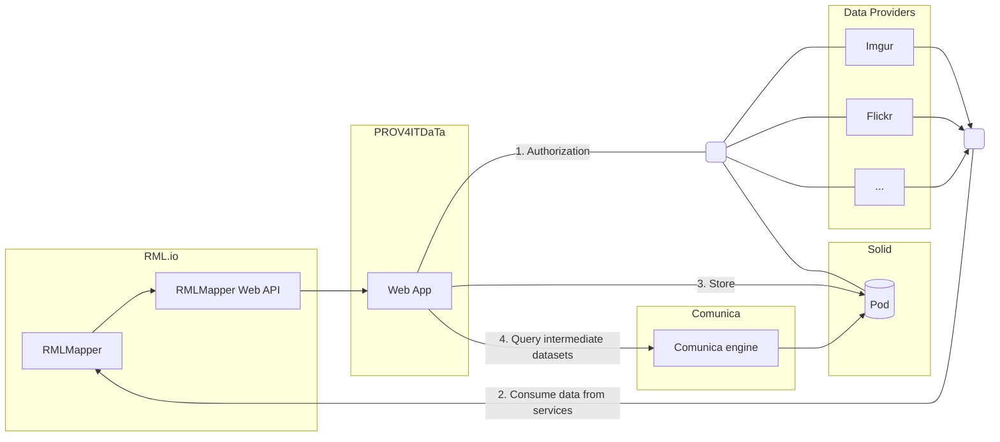
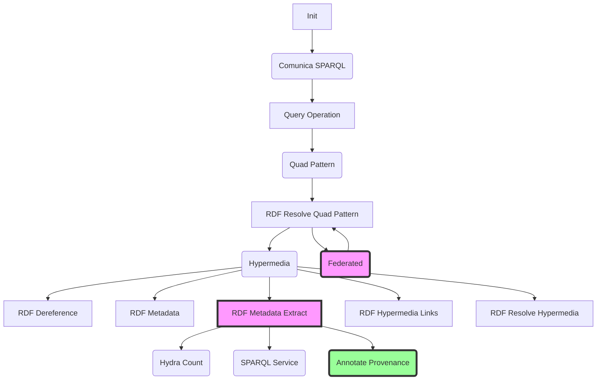

# PROV4ITDaTa - Technical Report

<style>
:not(pre):not(.hljs) > code {
	color: #695E25 !important; /* Override color */
}

:not(figure) > img {
  max-width: 600px;
  max-height: 600px
}
</style>

> PROV4ITDaTa is available at <https://prov4itdata.ilabt.imec.be>

> An online version of this report is available at <https://prov4itdata.ilabt.imec.be/docs/>

- [PROV4ITDaTa - Technical Report](#prov4itdata---technical-report)
  - [Alignment to the milestones](#alignment-to-the-milestones)
  - [Architecture](#architecture)
    - [Components](#components)
    - [Relation to DTP](#relation-to-dtp)
  - [Requirements](#requirements)
  - [Demonstrator](#demonstrator)
  - [Use cases](#use-cases)
    - [Best-practice vocabularies](#best-practice-vocabularies)
    - [Flickr](#flickr)
    - [Imgur](#imgur)
    - [Google People API](#google-people-api)
  - [Adding data providers](#adding-data-providers)
  - [Features](#features)
    - [Use Open Standards and Open Source](#use-open-standards-and-open-source)
    - [Mapping files to transfer data](#mapping-files-to-transfer-data)
    - [Automatic Data Provenance Generation](#automatic-data-provenance-generation)
    - [Output RDF](#output-rdf)
    - [Data Portability](#data-portability)
    - [Security and Privacy](#security-and-privacy)
    - [Personalization](#personalization)
    - [Quality](#quality)
    - [GDPR](#gdpr)
  - [Conclusion](#conclusion)
  - [Changelog](#changelog)
    - [v0.2.0 - 2021-02-05](#v020---2021-02-05)
    - [v0.1.1 - 2020-12-21](#v011---2020-12-21)
    - [v0.1.0 - 2020-11-30](#v010---2020-11-30)
  - [References](#references)

Data portability is one of the pillars to enable users to control their data on the Web.
Initiatives such as the [Data Transfer Project][DTP] (DTP) take a step in this direction,
by providing an open-source, service-to-service data portability platform
so that individuals could move their data whenever they want.
However, such efforts — being hard-coded — miss transparency and interoperability.
On the one hand, when data is transferred between services,
there is no trust in whether this transfer was of high quality.
To assess the transfer's quality, assessment would require reviewing the source code, as data provenance is unavailable.
On the other hand, complying with this hard-coded platform requires development effort to create custom data models.
Existing interoperability standards are neglected.

In PROV4ITDaTa, we create a solution that is fully transparent and has a fine-grained configuration to improve interoperability with other data models. Furthermore, the intermediate dataset generated from the source data and its provenance are [FAIR] resources.
To achieve this, we will exploit and advance the existing open-source tools [RML.io] and [Comunica]
and show its extensibility by directly applying it to the [Solid] ecosystem.

- RML.io is a declarative and generic toolset
to transparently generate FAIR Linked Data from (semi-)structured heterogeneous data
with automatic data provenance and fine-grained configuration to extract and transform (parts of) the source data.
- Using Comunica, we can query multiple intermediate datasets to transfer to a new
service, generating a provenance trail of where the resulting data came from.

Combining RML.io and Comunica for a fully transparent transfer process,
we improve current data portability approaches.
Also, assessing the provenance trail can add trust to a transfer process.
Being a fine-grained and declarative system, it sets up detailed configuration and provenance generation.
The transfer of personal data can be assessed before the data is accessed,
and legal audits can be performed automatically based on the structured and semantically sound provenance trail.
To show its applicability and extensibility for decentralized environments,
we will connect it to the Solid ecosystem,
giving users full control over their data.

> This is an intermediate report. As such, some sections are currently intentionally left blank or incomplete.

## Alignment to the milestones

#### M1: Design configuration-based DTP exporter, applying it to a use case (deadline 10/2020)

See [Architecture](#architecture) on how we used RML.io to export data from DTP-like services

#### M2: Improve data provenance of the DTP exporter (deadline 12/2020)

See [Components/RMLMapper](#rmlmapper) and [Components/Web App](#web-app)
on how we automatically generate and showcase data provenance information as an interoperable resource in RDF.

#### M3: Design query-based DTP importer for Solid, applying it to a use case (deadline 01/2020)

Currently, we directly import the exported data in RDF into a Solid pod, see [Components/Web App](#web-app).
We further designed the query-based importer: we will extend Comunica to perform federated queries over both Solid pods and other RDF data sources,
whilst automatically generating the correct provenance information.
We are currently researching and implementing the automated provenance information, see [Components/Comunica](#comunica).

#### M4: Implement configuration-based DTP exporter (deadline 04/2020)

> This work is ongoing

See [Components/RML Mapping Documents](#rml-mapping-documents) and [Components/RMLMapper](#rmlmapper)
on how we allow personalizable and configurable export of multiple DTP services in RDF, using RML.io.
We further extend this work allowing federated querying and schema translation
-- resulting in more flexible export options --
with Comunica, see [Components/Comunica](#comunica).

#### M5: Implement provenance-based DTP exporter (deadline 05/2020)

> This work is ongoing

We aligned with the design executed in M3, and are currently prototyping this feature, see [Components/Comunica](#comunica).

#### M6: Implement query-based DTP importer for Solid (deadline 04/2020)

> This work is ongoing

Currently, we directly import the exported data in RDF into a Solid pod, see [Components/Web App](#web-app).
To allow for configurability, we already support multiple configurations
for exporting the data, see our progress in M4.

#### M7: Integrate and finalize the exporter and importer, showcasing the use case (deadline 05/2020)

> This work is ongoing

Our first sprint contained an end-to-end solution without a query-based importer.
Our second sprint refactored the user interface to ease future extensibility and included an additional connector, see [Demonstrator](#demonstrator).
Our ongoing sprint is to include the query-based configuration and Comunica engine.

## Architecture



### Components

The architecture comprises five main components

- PROVIT4DaTa Web App: a user interface to allow users to transparently transport their data
- Data Providers: an extensible set of existing (social) Data Providers from which the user can transfer its data
- RML.io toolset: a set of open-source tools to generate standardized knowledge graphs from heterogeneous data sources
- Solid pods: a personal data storage, putting the user in control of their data
- Comunica: a federated querying engine to integrate data from different sources and possibly rewrite the data schema

The main component is the PROV4ITDaTa Web App, which performs the different steps required for transferring data from services (e.g. Flickr, Imgur, etc.) to a Solid pod.

1. During the first step, the Web App obtains the credentials for authorized access to the services and the Solid pod.
2. In the second step, the RML.io toolset provides the necessary components for
   1. consuming (protected) resources from Web APIs, and
   2. transforming the fetched data to [RDF].
3. In the third step, the [Web App](#web-app) stores the [RDF] and [provenance] data, generated by the [RMLMapper-JAVA], to the Solid pod.
4. In the fourth step, the newly generated [RDF] data can be integrated with internal and external data sources, transformed, and again stored in the Solid pod.

#### RML Mapping documents

An RML Mapping provides the means to create semantically enriched RDF data from heterogenous and (semi-) structured sources, using a declarative set of rules ([RML][RML-spec]).

Describing the Web API as a source in an RML Mapping allows the [RMLMapper][RMLMapper-JAVA] to determine how requests should be made to consume the Web API. Furthermore, it requires a one-time effort and avoids hard-coded implementations for each service to be added. The mapping can easily be reused for — and extended to — similar Web APIs.

#### RMLMapper

The [RMLMapper][RMLMapper-JAVA], proxied by the [RMLMapper Web API](#web-app), processes the selected RML Mapping and yields both the generated [RDF] and [provenance] data.

In the background, the RML Mapper determines how to consume a Web API based on its description, without the need for integrating code that is tightly coupled to a specific Web API. Such hard-coded implementations are error-prone and time-consuming (consider, for example, the creation of tests and rebuilding the application every time a service is added).

#### Solid pods

Solid pods can be used to create a [Personal Information Management System][PIMS] (PIMS),
giving individuals more control over their personal data.
Individuals can manage their personal data in secure online decentralized storage systems called pods:
secure personal web servers for data.
All data in a pod is accessible via the Solid Protocol.

When data is stored in someone's pod, they control who and what can access it.
and share them when and with whom they choose using Solid pods.
Providers of online services and advertisers need to interact with the Solid pod if they plan to process the individual's data.
This enables a human-centric approach to personal information and new business models.

Any kind of data can be stored in a Solid pod, however, the ability to store Linked Data is what makes Solid special.
Linked Data gives Solid a common way to describe things and how they relate to each other,
in a way that other people and machines can understand.
This means that the data stored by Solid is portable and completely interoperable.

Anyone or anything that accesses data in a Solid pod uses a unique ID,
authenticated by a decentralized extension of [OpenID Connect][OpenIDConnect].
Solid's access control system uses these IDs to determine whether a person or application has access to a resource in a pod.

#### Comunica

Comunica provides a meta-query engine that is designed in a highly modular and configurable manner to deal with the heterogeneous nature of Linked Data on the Web, allowing to fine-tune the Comunica engine to completely suit the needs of the system.
Furthermore, Comunica also supports executing SPARQL queries over one or more interfaces.

Incorporating Comunica, as depicted in the Architectural diagram above, allows us to select data from the intermediary datasets on the Solid Pod and transfer it to new services.

Moreover, we are working on adding provenance to the Comunica architecture as well, based on the design we made in <https://github.com/comunica/comunica/issues/732/>.
The goal is to provide the ability to add different levels of provenance:

- High-level: provenance w.r.t. the query result. This encompasses information about the SPARQL query that was executed, the query optimization plan, the sources that were queried, and the configuration of the Comunica engine.
- Low-level: provenance w.r.t. the elements of a query result. Such as adding information about the different query operations that were executed to yield a particular binding result.

Currently, our prototype complements every binding in a query result with provenance about its source.
This is accomplished by adding a new actor to the [Comunica architecture](https://comunica.dev/docs/modify/advanced/architecture_sparql/) that is able to extract all necessary metadata about the sources and add it to the provenance data.

The following architectural diagram illustrates how we added the new Annotate Provenance actor to the Comunica architecture.



We need to include a new `Annotate Provenance` Actor that allows us to automatically generate provenance information for each queried data source,  and adapt the `Federated` Actor to detect and properly process the provenance information coming from different data sources.

#### Web App

The Web App is the main entry point, allowing the user to select and execute an [RML Mapping][RML-mapping] describing which Data Provider to consume data from, and how that data will be transformed to [RDF].

Upon selecting an RML Mapping, the user can view and download its contents through the corresponding "RML Rules"-card (see [Demonstrator](#Demonstrator)).
Using this RML Mapping, the user can inspect *how* its data will be processed **prior to execution**, and **without requiring to inspect the source code**.

> At this point, the raw RDF RML description is shown to the user,
> however, since it is a structured semantic format,
> automatic visualizations and explanatory descriptions can be created.

The Web App guides the user through the necessary authorization steps, prior to execution.
Given the vulnerable information being exchanged, communication with the Web App occurs over [HTTPS].

After successful execution, the generated [RDF] and [provenance] become available for inspection and download.
The provenance information, structured using the W3C recommended standard [PROV-O],
allows further automatic processing to validate that all data is processed correctly according to the user's expectations.

By providing the user not only with the generated [RDF] but also with the [data provenance][provenance],
we address the transparency requirement other solutions lack.

The resulting [RDF] is stored onto the user's [Solid] pod, which can be verified through the "Solid"-card (see [Demonstrator](#Demonstrator)).

As a result, this web app allows to unambiguously define the user's data using an RML Mapping and transparently transfer it between services.
The automatically generated provenance allows for inspection and validation of the processing.

### Relation to DTP

After reviewing the DTP repository, we concluded that although utility functions could be reused at a later stage,
we currently focus on an end-to-end system using solely RML.io and Comunica.
On the one hand, because these technologies allow more advanced data transfer processes than DTP (such as joining data from _different services_ on the fly),
on the other hand, because integration efforts would put a too high burden on the current development sprints.

Once we have successfully created and validated our end-to-end demonstrator,
we will re-evaluate DTP and how we can properly integrate our technologies.

Below, a sketch is found into how we can integrate our technologies:
the DTP Input-Service utility functions are reused to authenticate and fetch data, the RML processing component and Comunica engine are wrapped in a DTP Data model interface as a new generic DTP component.


## Requirements

We set out the following requirements,
and linked them to the specific sections of the features we currently support,

- Configurable data portability and Personalization (available using personalized RML Mapping documents to configure the data transfer, see [this section](#mapping-files-to-transfer-data))
- White-box data portability (via automatic data provenance generation, see [this section](#automatic-data-provenance-generation))
- Data Transparency when transferring your data (available as RML Mapping documents are also RDF, see [this section](#mapping-files-to-transfer-data))
- FAIR Data Transfer (by using RDF as intermediate data model, see [this section](#output-rdf))
- Data Interoperability (by using RDF as intermediate data model and configuration data model, see [this section](#output-rdf) and [this section](#mapping-files-to-transfer-data))
- Security (using standard secure connections such as HTTPS, see [this section](#security))
- Quality (using default configuration files crafted by experts, and bound to quality checks, see [this section](#quality))

In general, our system is comparable to DTP, as it supports (and is extensible to) multiple data sources, and allows data import into SOLID pods (see [this section](#data-portability)).

## Demonstrator

The upper part of the landing page provides the means for quickly initiating the transfer from a service to a [Solid] pod. Once the user selects the desired [RML Mapping][RML-mapping], the transfer can be initiated by clicking the `[Execute]`-button. Initially, the user will be prompted to authorize with the [Solid] pod and the service defined as the source in the [RML Mapping][RML-mapping].

The lower part allows the user to review

- the [RML Mapping][RML-mapping],
- the generated [RDF], and
- the [provenance], hence, upholding the transparency of our solution.

Furthermore, the user can inspect and verify that the generated [RDF] was successfully stored on to the [Solid] pod.


The walkthrough above illustrates the flow of transferring data from a Data Provider (in this case, Flickr) to a Solid pod.

1. First, the user selects an [RML Mapping][RML-mapping] which comes available for inspection and download within the "RML Rules"-card.
2. Once the user has decided on which [RML Mapping][RML-mapping] to use, the transfer process is triggered by pressing `[Execute]`.
3. When transferring for the first time, the user will have to log in to the Solid pod.
4. Once the user has authenticated with Solid, the user will have to authenticate with multiple Data Providers (in this case, Flickr, Imgur, and Google Contacts).
5. At this point, the actual transfer takes place. Upon success, the user will be notified and the generated [RDF], accompanied by its [provenance], will be available for inspection and download in the "Generated RDF"-card and "Provenance"-card, respectively.
6. Finally, the user can inspect the data being stored on the Solid pod through the "Solid"-card.

## Use cases

Our toolchain is extensible to a wide variety of services.
We opted to initially support [Flickr](#Flickr) and [Imgur](#Imgur).
Both services share a common purpose: uploading and sharing image-content.
However, despite this commonality, they differ in various aspects such as the underlying data model and how the resources should be accessed.
Additionally, we support the [Google People API](#google-people-api).
This latter connector has a similar access method to Imgur (JSON Web API via OAuth 2.0), but contains data in a very different data model.

There are four different resources to model

- A single Image resource
- An Image Gallery that contains Image resources
- A Collection that contains Image Gallery resources
- A contact person

> Our current use cases already showcase the flexibility of our approach,
> however, more use cases will be supported in the following sprints.

### Best-practice vocabularies

#### Schema.org

##### Image

Images can be mapped to `schema:ImageObject`-resources, which inherits properties from `schema:MediaObject` that can be used for describing the height, width, and more.

##### Image Gallery

An Image Gallery can be represented using `schema:ImageGallery`. Furthermore, the images it contains can be linked using the `schema:hasPart` property.

##### Collection

A Collection can be modeled through a `schema:Collection`, which can be linked to its Image Gallery resources through the `schema:hasPart` property.

##### Person

A Person can be modeled using a `schema:Person`.

#### DCAT

##### Image

We can model an Image as a `dcat:Distribution`.

> `dcat:Distribution`
> A specific representation of a dataset. A dataset might be available in multiple serializations that may differ in various ways, including natural language, media-type or format, schematic organization, temporal and spatial resolution, level of detail or profiles (which might specify any or all of the above).

The `dcat:Distribution` class has the following properties

- `title`
- `description`
- `issued`: date of issuance (e.g publication)
- [`dcat:accessURL`](https://www.w3.org/TR/vocab-dcat-2/#Property:distribution_access_url) *SHOULD* be used for the URL of a service or location that can provide access to this distribution, typically through a Web form, query or API call.
- [`dcat:downloadURL`](https://www.w3.org/TR/vocab-dcat-2/#Property:distribution_download_url) is preferred for direct links to downloadable resources.
- `dcat:mediaType`: The media type of the distribution as defined by IANA
- `dct:format`: The file format of the distribution.
- `dcat:accessService`, pointing to a `dcat:DataService`

##### Image gallery

We can model an Image Gallery as a `dcat:Dataset`, which can point to **zero or more** `dcat:Distribution`s.

##### Collection

[DCAT] contains a `dcat:Catalog` class, a curated collection of metadata about resources (e.g., datasets and data services in the context of a data catalog).
A `dcat:Catalog` can be linked to **zero or more** `dcat:Dataset`s.

### Flickr

Flickr is an online photo management and sharing application.
Its resources are made available through the [Flickr API][Flickr-API]. Flickr follows the [OAuth1.0a] protocol which requires that requests to protected resources are signed using the Consumer Secret and Token Secret. By specifying the protocol in the [RML Mapping][RML-mapping] the [RMLMapper-JAVA] takes care of the necessary steps for creating requests to protected resources. This also contributes to the extensibility of our solution: when a service decides to change to another protocol, only changes to the [RML Mapping][RML-mapping] must be made. Hence, avoiding the need for rebuilding code.

#### Using Schema.org

- A Flickr Photo resource can be mapped to a `schema:ImageObject`.
- A Flickr Photoset resource can be mapped to instances of `schema:ImageGallery`. The table below shows how its properties are mapped.
- A Flickr Collection, which can contain Albums/Photosets, can be mapped using the `schema:Collection` class. The table below shows how its properties are mapped.

| Flickr Photoset resource | `schema:ImageGallery` |
| ------------------------ | --------------------- |
| `id`                     | `schema:identifier`   |
| `title._content`         | `schema:name`         |
| `description._content`   | `schema:description`  |

| Flickr Collection resource | `schema:Collection`  |
| -------------------------- | -------------------- |
| `id`                       | `schema:identifier`  |
| `title`                    | `schema:name`        |
| `description`              | `schema:description` |

#### Using DCAT

- An image resource can be modeled by a `dcat:Distribution`
- A Flickr Album can contain image resources
- A Flickr Collection can contain Flickr Albums, which contain image resources. Therefore, a Flickr Collection can be modeled by a `dcat:Catalog` which can be linked to **zero or more** `dcat:Dataset`s (Albums)

### Imgur

Imgur, an image hosting and sharing website, enables its users to quickly upload and share images and GIFs on social media platforms (e.g. Reddit, Twitter, etc.).
Unlike the Flickr API, the [Imgur API][Imgur-API] uses OAuth 2.0.
When making requests for protected resources it suffices to add a bearer token to the HTTP headers.

The data fields mapped from the Imgur image resources are

- `id`: a unique identifier for that image
- `link`: the URL to the image
- `description`: the description of the image
- `views`: the number of views
- `height`: height of the image
- `width`: width of the image

#### Using Schema.org

An Imgur image can be mapped to a `schema:ImageObject`, along with the following properties:

| Imgur image resource | `schema:ImageObject`          |     |
| -------------------- | ----------------------------- | --- |
| `id`                 | `schema:identifier`           |     |
| `title`              | `schema:name`                 |     |
| `description`        | `schema:description`          |     |
| `link`               | `schema:url`                  | *   |
|                      | `schema:image`                | *   |
| `type`               | `schema:encodingFormat`       |     |
| `height`             | `schema:height`               |     |
| `width`              | `schema:width`                |     |
| `views`              | `schema:interactionStatistic` |     |

> *Multiple properties are suitable for mapping the `link` property.

#### Using DCAT

- An image resource can be modeled by a `dcat:Distribution`.
- A Imgur Album can contain image resources, and can be modeled by `dcat:Dataset`.
- An Imgur Gallery can contain Imgur Albums, which contain image resources. Therefore, an Imgur Gallery can be modeled by a `dcat:Catalog` which can be linked to **zero or more** `dcat:Dataset`s (Albums).

### Google People API

Using the [Google People API](https://developers.google.com/people?hl=en) we can transfer our Google contacts.

> Please note that this use case can be extended easily to [other Google Products](https://developers.google.com/products?hl=en).

#### Using Schema.org

A Google contact can be mapped to a `schema:Person`, along with the following properties:

| Google contact resource | `schema:Person`          |
| ----------------------- | ------------------------ |
| `givenName`             | `schema:givenName`       |
| `familyName`            | `schema:familyName`      |
| `displayName`           | `schema:alternativeName` |

## Adding data providers

This section will walk you through the different steps of adding a data provider to the PROV4ITDaTa Web-App, where the Google People API serves as an example.

#### Google People API

First, we discuss the configuration steps on the Google Cloud Platform.
Secondly, we elaborate on how to define the [Google People API] as a logical source in an RML Mapping.

##### Google Cloud Platform configuration

Prerequisites:

- Google Developer Account

Steps:

- Go to the [Google Developer Console](https://console.developers.google.com/)
  create a project. In this example, the project was named `PROV4ITDaTa-DAPSI`
- For any further steps, make sure the project you created in the previous step is active. This is shown at the top of the console, as depicted by the following figure.
  <br/>
- Navigate to *APIs & Services*
  <br/>
- Search and enable the API you wish to integrate. In this case, the [Google People API](https://console.cloud.google.com/apis/library/people.googleapis.com)
- In order to make requests to the API, you need to set up authorization.
  - Since we need to access private data, OAuth 2.0 credentials must be generated.
  - Go to the [Credentials page](https://console.developers.google.com/apis/credentials), click on *Create Credentials* and select *OAuth client ID*
    <br/>
  - Set the *Application Type* to *Web Application*, enter a name, and add authorization redirect URI(s) pointing back to your web-app server.
    - For example, assuming the web-app is served locally on port `3000`, the redirect URI would be: `https://localhost:3000/connect/google/callback`
    - Don't forget to save the *Client ID* and *Client secret*, as you will need it later on.
- Since our Google app's publishing status is "testing", only test users will be able to use it. Navigate to the *OAuth consent screen* using the panel on the left, and add the test users.
  <br/>
- Finally, add the *Client ID*, *Client secret* to the `config.json`. This may look like

```json
{
  "defaults": {
    "origin": "https://localhost:3000",
    "transport": "session"
  },
  "imgur": {
  },
  "flickr": {
  },
  "google": {
    "key": "<Client ID goes here>",
    "secret": "<Client secret goes here>",
    "callback" : "https://localhost:3000/google/callback",
    "scope" : [ "https://www.googleapis.com/auth/contacts.readonly"]
  }
}

```

For more information on setting up a Google app that uses the Google People API, check out

- <https://developers.google.com/people/v1/how-tos/authorizing>
- <https://developers.google.com/identity/protocols/oauth2>

#### Creating an RML Mapping that consumes and transforms the Google People API

When creating an RML Mapping, you always have to define exactly one [`rml:logicalSource`](https://rml.io/specs/rml/#logical-source)
for every triples map you define. This way, the RML Processor knows where and how to access the data to be mapped.
Using the  `rml:logicalSource`'s `rml:source` property we can specify the URL of the Web API.

To access protected resources, the RML Processor needs to include the required credentials when consuming the API.
The Google People API uses OAuth 2.0, and an authorization header should be added to the requests. Since these credentials
are managed by our web-app, the value for the authorization header is a template-variable, hence, the web-app will
recognize this and fill in the value.

The following is an excerpt of the `rml:source` defined in [`rml/google/contact-transfer-using-schema-org.ttl`](/rml/google/contact-transfer-using-schema-org.ttl):

```turtle
:google_source 
    ex:AuthorizationHeader "{{authorizationHeader}}" ;
    schema:name "Google API" ;
    schema:url <https://people.googleapis.com/v1/people/me/connections?personFields=names> ;
    <http://www.w3.org/1999/02/22-rdf-syntax-ns#type> schema:WebAPI .
```

## Features

Within this project, we envisioned the following features.

- Allowing users to choose from [RML Mapping][RML-mapping]s crafted by experts. This allows for personalization of the data processing pipeline whilst reassuring qualitative transformation. See [Mapping files to transfer data](#mapping-files-to-transfer-data).
- Allowing the users to inspect how data was transformed by the selected [RML Mapping][RML-mapping]. See [provenance].
- Transparent transfer of user data to [Solid] pods. See [Output RDF](#output-rdf).
- Extensible to any number of services, without requiring rebuilding the software. See [Data portability](#data-portability).
- Making use of Open Standards and Open Source software. See [Use Open Standards and Open Source](#use-open-standards-and-open-source).

### Use Open Standards and Open Source

By supporting existing standards where possible,
we aim to minimize the required foundational work.
Widespread adoption and understanding of existing standards make this possible.

PROV4ITDaTa is an Open Source initiative to transparently transfer data from Data Providers to your personal data vault.

It makes use of Open Standards such as:

- the [OAuth] protocol to authenticate with Data Providers where possible,
- an [OpenID Connect][OpenIDConnect] extension to authenticate with the Solid pods,
- the [REST architectural style][REST] to publish our PROV4ITDaTa Web app,
- the [Resource Description Format][RDF] (RDF) to model our personal data in a structured and semantic knowledge graph,
- the [R2RML] extension [RML][RML-spec] to declaratively describe how to generate RDF knowledge graphs from heterogeneous data sources, and
- the [Linked Data Platform][LDP] specification to interact with the Solid pods.

It contributes to the following Open Source projects:

- [RMLMapper-java][RMLMapper-JAVA] (MIT licensed): the RML processor generate the RDF knowledge graphs;
- [RMLMapper web API][RMLMapper-api] (MIT licensed): a wrapper to publish the RMLMapper-java as a RESTful web service; and
- PROV4ITData Web app (MIT licensed): the web application to interlink the different components.
- [Comunica] (MIT licensed), a knowledge graph querying framework.

### Mapping files to transfer data

In PROV4ITDaTa, the original Data Provider data is transformed into well-defined [RDF] knowledge graphs.
As such, the resulting data have a clear context and meaning by using established semantic ontologies,
and the original data is made interoperable.

Instead of relying on a hard-coded system to generate the RDF knowledge graph,
we make use of the [RDF Mapping Language][RML-spec]:
a language to declaratively describe how to generate RDF knowledge graphs from heterogeneous data sources.
These mapping files are created manually by experts,
to ensure that established ontologies are used, and high-quality knowledge graphs are generated.

As the [RML Mapping][RML-mapping]s can include data transformations,
we can ensure data is cleansed during the data transfer process.

The resulting data transfer process adheres to the [FAIR] principles, as the [RML Mapping][RML-mapping]s are

- _Findable_ on the Web App as RDF resources following the [RML specification][RML-spec], based on the [R2RML W3C standard][R2RML],
- _Accessible_ via [RESTful APIs][REST],
- _Interoperable_ as established semantic ontologies are used, and
- _Reusable_ as all mappings are published within the Web app as MIT license

As such, the data transfer process is fully transparent.

For each Data Provider, a mapping needs to be created manually (as is the case in DTP where a connector needs to be created for each service).
The input of a mapping is defined by describing how a Data Provider's Web API will be accessed (endpoint URL, authorization protocol, response format, etc.).
This way, the [RMLMapper][RMLMapper-JAVA] knows how to consume the Web API. Hence, the actual input of a mapping is the response returned by the Web API.
Furthermore, the input will be mapped according to the rules in the mapping, resulting in semantically sound [RDF] which is stored on the user's Solid pod.

Therefore, once the input of mapping is described, it can easily be reused for creating other mappings for that Data Provider.
Our advantage is that the mapping process is transparent and more easily adaptable when the data model changes.

### Automatic Data Provenance Generation

Provenance and other metadata are essential for determining ownership and trust.
However, defining such metadata typically stayed independent of the generation process.
In most cases, metadata is manually defined by the data publishers, rather than produced by the involved applications.
In PROV4ITDaTa, we rely on the [RML Mapping][RML-mapping]s that specify how the RDF knowledge graphs are generated
to automatically and incrementally generate complete provenance and metadata information of the data transfer process.
This way, it is assured that the metadata information is accurate, consistent, and complete.
The resulting provenance information can be inspected by the user once the transfer process is completed.

The provenance information is described using the W3C recommended [PROV-O] standard.
It covers the RDF knowledge graph generation, including metadata for the mapping rules definition and the data descriptions.
By automating the provenance and metadata generation relying on the machine-interpretable descriptions in the [RML Mapping][RML-mapping]s,
metadata is generated in a systematic way and the generated provenance and metadata information becomes more accurate, consistent, and complete.

Because of this provenance information, the data transfer process is not only fully transparent before, but also after processing the data.

### Output RDF

By relying on Semantic Web technologies, we achieve interoperability on multiple levels.

#### Syntactic Interoperability

Our solution provides multiple levels of Syntactic Interoperability by leveraging the standardized [Turtle]-syntax for

1. Defining the [RML Mapping][RML-mapping]s, which includes describing the Data Provider's Web APIs.
2. Representing the [RDF] and [provenance] generated by the [RML Mapper][RMLMapper-JAVA].
3. Storing the resulting [RDF] on the Solid pods.

#### Semantic Interoperability

Semantic Interoperability is achieved when multiple systems are able to develop the same understanding of the data.
To this end, the following choices were made

- The generated [RDF] data is accompanied by the corresponding provenance data.
- The source data originating from the Data Providers is mapped in a generic manner using established ontologies.

#### Structural Interoperability

Our solution solely produces [RDF] data, which by itself, offers the means to accommodate for Structural Interoperability.

#### Data Compatibility

Storing the transformed data, provenance, and other metadata using the [RDF] model enables us to correctly integrate the resulting data sets from different Data Providers.

### Data Portability

By transferring data from Data Providers to the user's [Solid] pod we leverage Data Portability, which is one of [Solid]'s primary features.

### Security and Privacy

As there are multiple parties involved in the data transfer (the user, Data Providers, Solid pods, and PROV4ITDaTa Web App)
not one person or entity can fully ensure the security and privacy of the entire system.
Instead, responsibility is shared among all the participants.
Here are some of the responsibilities and leading practices that contribute to the security and privacy of the system.
We will describe how these responsibilities are tackled, specifically in PROV4ITDaTa.

#### Data Minimization

When transferring data between providers, data minimization should be practiced.
Practically this means that all parties should only process and retain the minimum set of data that is needed to provide their service.
In the PROV4ITDaTa components, no data is stored, only processed.
The user can inspect exactly which data fields are processed by inspecting the [RML Mapping][RML-mapping],
and how these data fields are processed by inspecting the [provenance data](#automatic-data-provenance-generation).
All generated data is sent to the Solid pod, which is under the full control of the user.

#### User Control

All PROV4ITDaTa transfer processes are initiated by the user, never automatically.
For each transfer process, the user needs to (re-)authenticate the PROV4ITDaTa process
— for both the Data Providers as the Solid pod —
using standardized authentication mechanisms such as [OAuth] where possible.
Also, no authentication tokens are stored after the process completes.
This to guarantee no unwilling data transfer processes are initiated.

The user further has full control to which Solid pod its data is stored,
and by providing multiple alternative [RML Mapping][RML-mapping]s,
it can personalize how the data is processed.

> Currently, a single Solid pod provider is supported (<https://solidcommunity.net>).
> Our roadmap includes the possibility to choose your Solid pod provider.

#### Minimal Scopes for Auth Tokens

Where possible, only minimal (read-only) scopes are requested for Auth Tokens at the different Data Providers.
This further increases transparency into exactly what data will be moved,
and increases security so that if tokens are somehow leaked they have the minimal possible privilege.

> For example, for the Flickr-service we only request the `read` scope, as this is possible in the [Flickr API][Flickr-API].
> For the [Imgur API][Imgur-API], however, there is no option to set a specific scope, so the default scope is used.

PROV4ITDaTa does not delete data from the Data Providers as part of the transfer.
This functionality is left to the Data Providers.

#### Data retention

PROV4ITDaTa stores data only for the duration of the transfer process,
and all data transfer uses transport layer security over secure HTTPS connections.
The provenance information is available for the remainder of the user session,
and storage of that provenance information needs to be initiated by the user if needed.

All authentication tokens are stored solely on the client-side for the duration of the transfer process,
and are thus ephemeral: these tokens are automatically removed when the user's browser session ends.

#### Abuse

The Data Providers should have strong abuse protections built into their APIs.
Since PROV4ITDaTa retains no user data beyond the life of a single transfer,
the Data Providers have the best tools to be able to detect and respond to abusive behavior,
e.g., using standard protocols such as [OAuth] to obtain API keys.

### Personalization

In PROV4ITData, [RML Mapping][RML-mapping]s are used to configure the data transfer process.
Multiple RML Mappings are available for the user, allowing for personalization:
the user can inspect the different RML Mappings, see which data fields are being processed,
and based on its context, choose which RML Mapping to execute.

### Quality

In PROV4ITDaTa, we ensure quality, both on data level as on software level.

#### Data Quality

The [RML Mapping][RML-mapping]s allow to transform data from heterogeneous data sources
into RDF Knowledge graphs.
The RML.io toolchain has been used in a [variety of existing projects and use cases](https://rml.io/usage/),
and allow to clean the original data by means of [FnO functions](https://fno.io/rml/).

The mappings are created manually by experts to ensure best practices,
and use established vocabularies.

#### Software Quality

All processing tools have been [tested and applied](https://rml.io/usage/) in production-like environments (TRL7),
and consist of unit and integration tests for

- RMLMapper-JAVA: <https://github.com/RMLio/rmlmapper-java/tree/master/src/test>
- RMLMapper-Web-API: <https://github.com/RMLio/rmlmapper-webapi-js/tree/master/test>
- Comunica: <https://coveralls.io/github/comunica/comunica?branch=master>

At <https://rml.io/implementation-report/>, you can compare our RMLMapper-JAVA processor with other RML processors.

### GDPR

As defined by Article 4 of the GDPR, PROV4ITData acts as a data processor for the end-user
(which become their own data controllers, conform to the EU digital sovereignty vision),
as it allows individuals to easily transfer their files and data directly from Data Providers to their Solid pods.

This does not influence the GDPR roles of its complementary modules.
Each Data Provider will maintain full control over determining who has access to the data stored on their systems.
Access tokens need to be requested from each Data Provider the user would like to transfer data from, and from each Solid pod it would like to transfer data to.
PROV4ITDaTa will not mediate data access rights between Data Providers or Solid pods.
This ensures that API quotas continue to be managed by the Data Providers,
thereby helping to mitigate traffic spikes and negative impacts across Data Providers.

The security requirements are in line with Article 32 of the GDRP:

- personal data is transferred using transport layer security
- no original personal data is destroyed
- no original personal data is accessed or transmitted without authorization

> At the time of writing, consent of the user is given via the authorization flows in the different Data Providers and Solid pods.
> We plan to include a clear privacy statement in the demonstrator.

## Conclusion

Currently, PROV4ITData showcases how users can transparently transfer their data from different Data Providers
to their Solid pod, using the RML.io toolchain.
We showcase transparency (by providing the [RML Mapping][RML-mapping]s the and [provenance] data),
and flexibility (by providing multiple Data Providers).

In our roadmap, we envision a general improvement of our demonstrator,
include a provenance-aware query-based importer using [Comunica],
and provide integration alternatives with, e.g., [DTP].

## Changelog

### v0.2.0 - 2021-02-05

#### Added

- Google API connector
- UI refactor

### v0.1.1 - 2020-12-21

#### Added

- Alternative mapping options
- RML mapping process clarification

### v0.1.0 - 2020-11-30

#### Added

- Initial version

## References

- B. De Meester, A. Dimou, R. Verborgh, and E. Mannens, “Detailed Provenance Capture of Data Processing,” in _Proceedings of the First Workshop on Enabling Open Semantic Science (SemSci)_, Oct. 2017, vol. 1931, pp. 31–38. Available: <http://ceur-ws.org/Vol-1931/#paper-05>.
- B. De Meester, W. Maroy, A. Dimou, R. Verborgh, and E. Mannens, “Declarative Data Transformations for Linked Data Generation: the case of DBpedia,” in _The Semantic Web: 14th International Conference, ESWC_, 2017, pp. 33–48, doi: [10.1007/978-3-319-58451-5_3](https://doi.org/10.1007/978-3-319-58451-5_3).
- A. Dimou, T. De Nies, R. Verborgh, E. Mannens, and R. Van de Walle, “Automated Metadata Generation for Linked Data Generation and Publishing Workflows,” in _Proceedings of the Workshop on Linked Data on the Web co-located with 25th International World Wide Web Conference (WWW2016)_, Montreal, Canada, Apr. 2016, vol. 1593. Available: <http://events.linkeddata.org/ldow2016/papers/LDOW2016_paper_04.pdf>.
- A. Dimou, M. Vander Sande, P. Colpaert, R. Verborgh, E. Mannens, and R. Van de Walle, “RML: A Generic Language for Integrated RDF Mappings of Heterogeneous Data,” in _Proceedings of the 7th Workshop on Linked Data on the Web_, 2014, vol. 1184. <http://ceur-ws.org/Vol-1184/ldow2014_paper_01.pdf>.
- R. T. Fielding, “Architectural Styles and the Design of Network-based Software Architectures,” phdthesis, University of California, Irvine, 2000.
- M. D. Wilkinson et al., “The FAIR Guiding Principles for scientific data management and stewardship,” _Scientific Data_, vol. 3, p. 160018, Mar. 2016, doi: [10.1038/sdata.2016.18](https://doi.org/10.1038/sdata.2016.18).

[RML-mapping]: #rml-mapping-documents
[provenance]: #automatic-data-provenance-generation

[Comunica]: https://comunica.dev/
[DCAT]: https://www.w3.org/TR/vocab-dcat-2/
[DTP]: https://datatransferproject.dev/
[FAIR]: https://www.go-fair.org/
[Flickr]: https://www.flickr.com/about
[Flickr-API]: https://www.flickr.com/services/developer/api/
[HTTPS]: https://www.ietf.org/rfc/rfc2818.txt
[Google People API]: https://developers.google.com/people?hl=en
[Imgur]: https://imgur.com/
[Imgur-API]: https://apidocs.imgur.com/
[LDP]: https://www.w3.org/TR/ldp/
[OAuth]: https://oauth.net/
[OAuth1.0a]: https://oauth.net/core/1.0a/
[OpenIDConnect]: https://openid.net/connect/
[PIMS]: https://edps.europa.eu/data-protection/our-work/subjects/personal-information-management-system_en
[PROV-O]: https://www.w3.org/TR/prov-o/
[RDF]: https://www.w3.org/TR/rdf-concepts/
[REST]: https://www.ics.uci.edu/~fielding/pubs/dissertation/top.htm
[R2RML]: https://www.w3.org/TR/r2rml/
[RML.io]: https://rml.io
[RML-spec]: http://rml.io/spec.html
[RMLMapper-JAVA]: https://github.com/RMLio/rmlmapper-java
[RMLMapper-api]: https://github.com/RMLio/rmlmapper-webapi-js
[Schema.org]: https://schema.org/docs/full.html
[Solid]: https://inrupt.com/solid/
[Turtle]: https://www.w3.org/TR/turtle/
